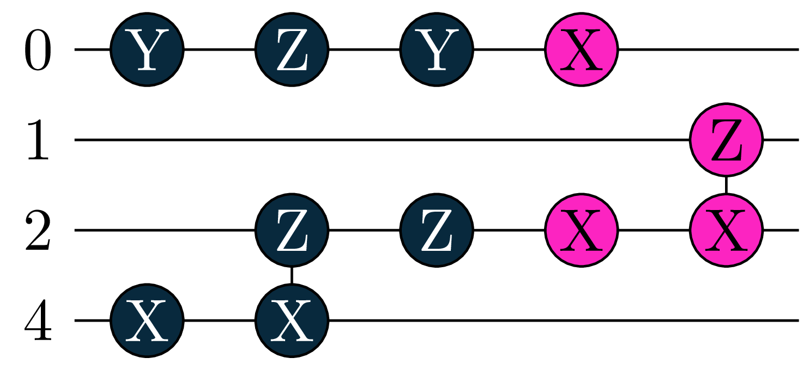

# Basic circuit serialization for tequila
- prototype status
- works with json
- can be used with orquestra

# Encode Circuits
Here is one explicit example  
```python
# not in tequila namespace yet
from genencoder import CircuitGenEncoder
import tequila as tq

my_tequila_circuit =  tq.gates.H(0)
my_tequila_circuit += tq.gates.X(target=4,control=2)
my_tequila_circuit += tq.gates.Rx(angle="a", target=0) 
my_tequila_circuit += tq.gates.Rx(angle="b", target=2, control=1)

encoder = CircuitGenEncoder()

# encode circuit
circuit_string1 = encoder(my_tequila_circuit)

# encode circuit with explicit variables
# this will determine only variable a, variable b stays a variable after decoding
circuit_string2 = encoder(my_tequila_circuit, variables={"a":2.0})

# deconde circuit
the_same_tequila_circuit = encoder(circuit_string1)
```
Currently everything is encoded generator-based. For gates like H and controls this might seem odd on first sight.  
The CRx gate is for example encoded as: exp(-i b/2 * G) with generator G = NOT(1) * X(2) = 0.5(1-Z)(1) * X(2),  
and the Hadamard gate as H = Ry(pi/4)Rz(pi)Ry(-pi/4).  

The encoded circuit strings are:  
```bash
circuit_string1 = @11.7810Y(0)|@3.1416Z(0)|@0.7854Y(0)|@0.5000X(4)|@12.0664Z(2)X(4)|@0.5000Z(2)|a@1.0000X(0)|b@0.5000X(2)|b@12.0664Z(1)X(2)| 
circuit_string2 = @11.7810Y(0)|@3.1416Z(0)|@0.7854Y(0)|@0.5000X(4)|@12.0664Z(2)X(4)|@0.5000Z(2)|@2.0000X(0)|b@0.5000X(2)|b@12.0664Z(1)X(2)|
```
Separators @ and | can be can be changed on initialization
``python
encoder = CircuitGenEncoder(angle_separator="@", gate_separator="|")
```



# Create Random circuits
```python
from genencoder import CircuitGenerator

#Some comments:
#connectivity = "local_line" # can be "local_ring" as well, or dictionary defining custom connectiviy: Example 4 qubits all connected to qubit 0 would be connectivity={0:[1,2,3], 1:[0], 2:[0], 3:[0]} (redundancies are not automatically corrected right now)
#fix_angles={"XY":numpy.pi/2} # will fix the angle of all gates with this generator to this value

generator = CircuitGenerator(depth=10, connectivity="local_line", n_qubits=4, generators=["Y", "XY"], fix_angles={"XY":numpy.pi/2})

my_random_circuit = generator()

``` 
    
    
